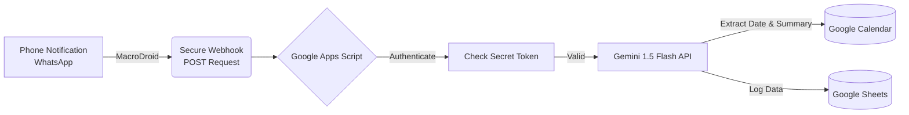

# WhatsApp to Calendar Automation

An automation bridge that intercepts WhatsApp assignment notifications and auto-schedules them in Google Calendar using **Gemini AI** for deadline extraction.

## Architecture

## How It Works
Trigger: A professor sends a message like "Assignment on HTML due 2025-12-20" on WhatsApp.

Intercept: MacroDroid (Android) catches the notification and filters it via Regex.

Secure Transmission: The message is sent to a Google Apps Script Webhook via HTTPS.

AI Processing: The script calls Gemini 1.5 Flash to extract:

Summary: "React Assignment"

Date: "2025-12-20"

Action: A calendar event is created automatically.

## Tech Stack
Logic: Google Apps Script (JavaScript)

AI Model: Gemini 1.5 Flash (via JSON Mode)

Mobile Automation: MacroDroid

Database: Google Sheets (for logging)

## Security
This project uses a Token-Based Authentication system.

The Webhook URL is public, but it requires a SECRET_TOKEN in the JSON payload.

Requests without the correct token are rejected with 403 Forbidden.

API Keys are stored in Script Properties, not in the source code.

## Setup Guide
Clone this repo.

Create a new Google Sheet & Apps Script.

Paste the contents of Code.gs.

Set Script Properties: GEMINI_API_KEY and SECRET_TOKEN.

Deploy as Web App (Access: Anyone).

Configure MacroDroid using macrodroid_setup.json.
